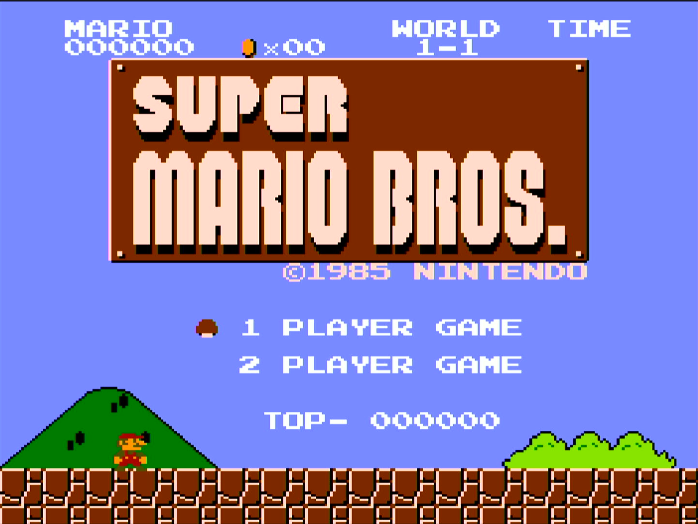
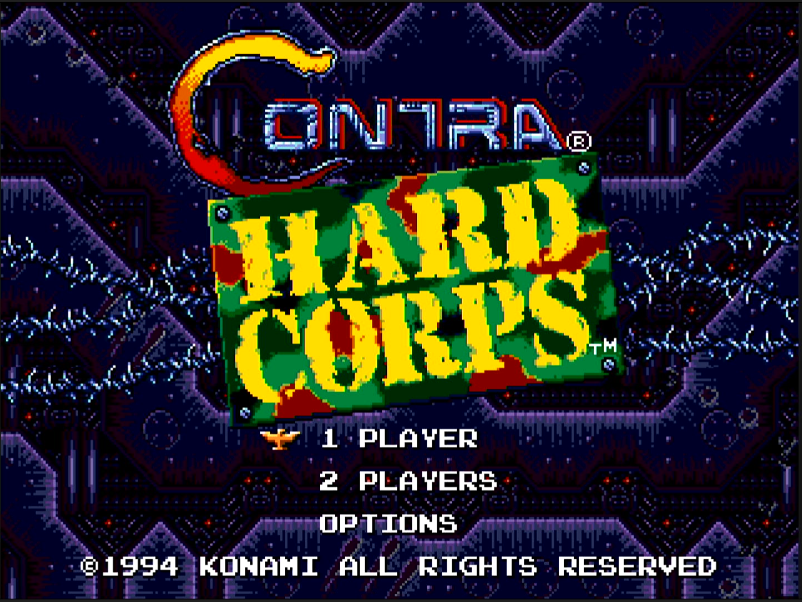
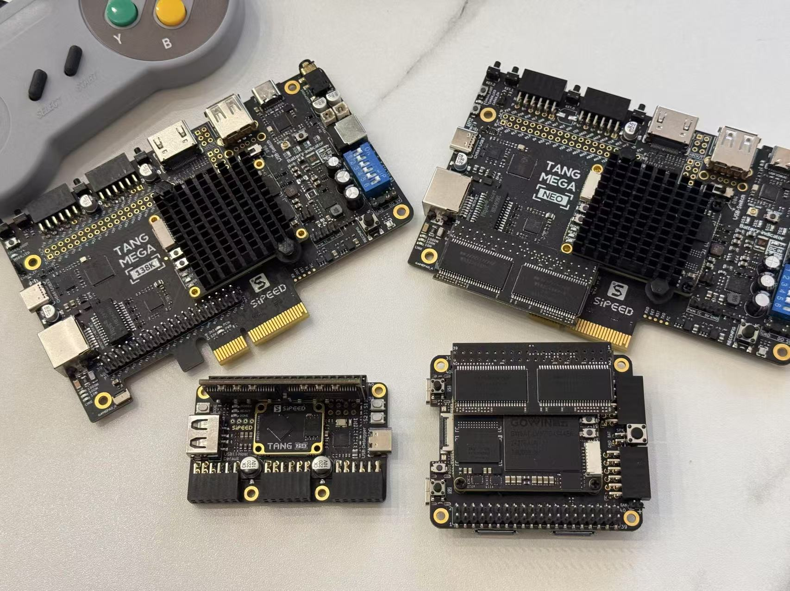

# TangCore - FPGA Gaming Distribution for Sipeed Tang

  <!--
  -->
  

TangCore is a comprehensive FPGA gaming distribution that brings classic gaming systems to Sipeed Tang FPGA boards. It combines multiple high-quality gaming cores into a single package with an easy-to-use menu system.

## 🎮 Supported Systems

  
  
  
  

- **[NESTang](nestang/)** - Nintendo Entertainment System
  - Cycle-accurate NES emulation
  - Extensive mapper support
  - 720p HDMI output

- **[SNESTang](snestang/)** - Super Nintendo Entertainment System
  - Support for LoROM, HiROM and ExHiROM
  - DSP-1/2/3/4, S-RTC, OBC-1 extension chips

- **[GBATang](gbatang/)** - Game Boy Advance
  - High compatibility
  - Open source BIOS included
  - Full 32MB gamepak support

- **[MDTang](mdtang/)** - Sega Genesis/Mega Drive
  - Accurate Genesis/Mega Drive emulation

## 💻 Supported Hardware

| Board Model | Status | Notes |
|------------|--------|-------|
| [Tang Console 60K](https://sipeed.com/tangconsole) | ✅ Recommended | Best overall experience |
| Tang Mega 60K | ✅ Fully supported | All cores available |
| Tang Mega 138K | ✅ Fully supported | All cores available |
| Tang Primer 25K | ⚠️ Limited | NES/SNES only |

 

## 🚀 Quick Start

For detailed setup instructions, please refer to our [Installation Guide](https://nand2mario.github.io/tangcore/user-guide/installation/). Here's a quick overview:

1. Download the latest [TangCore release](https://github.com/nand2mario/tangcore/releases)
2. Flash the firmware using Bouffalo Lab Dev Cube
3. Prepare a USB drive with FPGA cores and your game ROMs
4. Connect required peripherals (HDMI and controller)
5. Power on and enjoy!

## 🛠️ Development

TangCore uses a different architecture compared to individual cores (NESTang/SNESTang):
- Firmware runs on BL616 MCU instead of FPGA
- Fast core switching via JTAG
- USB storage support
- SOM-connector debugging interface

For detailed development information, see an introduction to [TangCore archtecture](https://nand2mario.github.io/tangcore/dev-guide/architecture/), [building from sources](https://nand2mario.github.io/tangcore/dev-guide/building/), how to [develop a new core](https://nand2mario.github.io/tangcore/dev-guide/core-development/), and [core debugging guide](https://nand2mario.github.io/tangcore/dev-guide/core-debugging/).

## 📝 License

TangCore firmware is licensed under Apache 2.0. Each core maintains its original license - please check individual core directories for details.

## 🙏 Acknowledgments

- MiSTer FPGA cores and their developers
- openFPGALoader by Gwenhael Goavec-Merou

## 📫 Contact

For updates and announcements, follow [@nand2mario](https://x.com/nand2mario) on X.

For support, please use the [GitHub Issues](https://github.com/nand2mario/tangcore/issues) page.  
