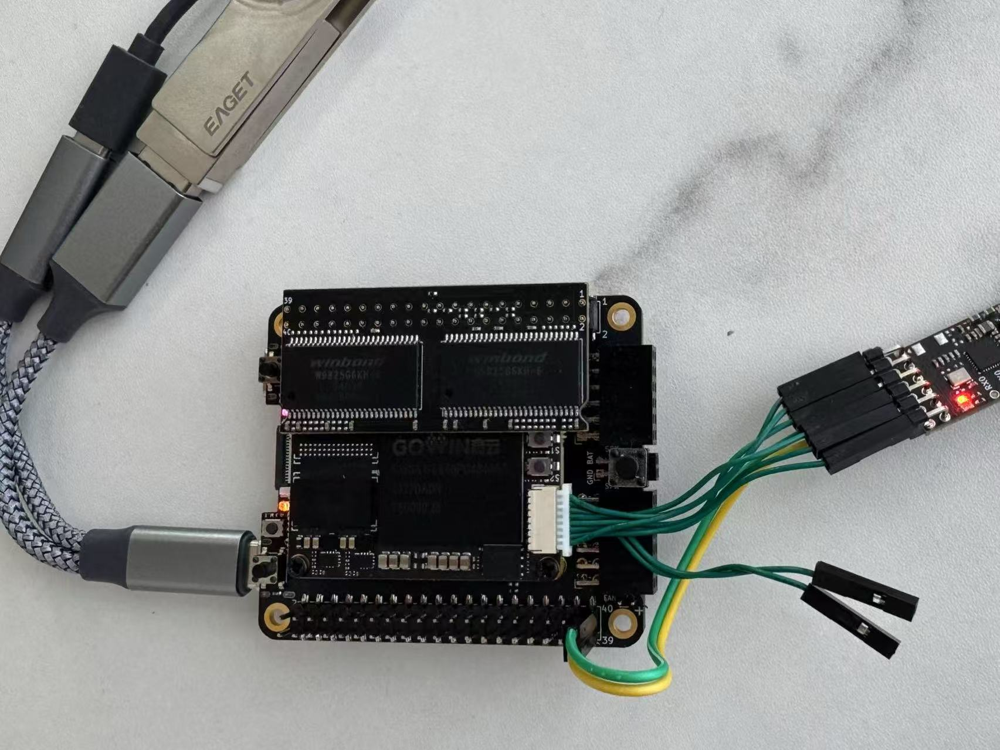

# TangCore development guide (draft)

## Architecture Overview

TangCore uses a different approach to development than previous versions of nestang/snestang. Here's a comparison of the two:

Old NESTang/SNESTang architecture:

TangCore architecture:

Here are the differences:
* The firmware runs on FPGA in old NESTang/SNESTang, while it now runs on the BL616 MCU. This saves a fair amount of FPGA resources, which should be used for the gaming cores.
* For core switching, the old NESTang/SNESTang needs to write to the NOR flash chip, which is slow. Now firmware-bl616 uses JTAG protocol to directly write to the FPGA SRAM, which is much faster.
* Before, the cores and roms are stored on the SD card. Now the cores and roms are stored on a USB stick connected to the BL616. Using the USB interface allows us to support more types of USB devices in the future.
* For debugging, we used to rely on UART-over-USB through the BL616. Now we use the debug connector on the FPGA SOM.

Here's a picture of the TangCore development setup:

The end user does not need the SOM connector for debugging. Otherwise the seutp is the same as the developement setup.

Debug connection:
* We use the Sipeed RV-debugger dongle to connect the FPGA to PC.
* The FPGA SOM debug port has the following pinout (from top to bottom): GND, BL616_RX, BL616_TX, TDI, TCK, TDO, TMS, 5V0. We connect the TDI, TCK, TDO, TMS pins to the RV-debugger. The RX/TX UART pins are not used for debugging, as they are already used for internal communication between the BL616 and the FPGA.

## Developing a core

[NESTang](https://github.com/nand2mario/nestang) can be used as a template for developing gaming cores for Tang Console. Here're the minimal set of parts that a core should have so it can be loaded by the TangCore template:

* `src/somecore_top.v`: the core top source file. As nestang_top.v shows, it should contains the machine-specific components, a HDMI display module and `iosys_bl616`, which is an interface over UART to the BL616 MCU.
* `src/hdmi/*`: HDMI display components
* `src/iosys/iosys_bl616.v`: the interface (referred to as "IO system") over UART to the BL616 MCU.
* `src/iosys/textdisp.v`: 32x28 text mode display to show the overlay text
* `src/iosys/uart_fractional.v`: the UART TX/RX modules

The other older io system module is `iosys_picorv32.v`. It uses a risc-v softcore running inside the FPGA to act as the IO processor. New cores should use `iosys_bl616`, the newer module.

If you open `iosys_bl616.v`, you will see that it provides a few useful pins,
* `overlay*`: these are signals for the "on-screen display" (OSD). It outputs a 256x224 image. When `overlay==1` (controlled by the MCU), it will be shown on screen.
* `joy*`: inputs to iosys. These joypad button states will be sent periodically to MCU to control the overlay menu.
* `rom_*`: When MCU starts ROM loading through the UART interface, data is output through these pins to the actual core.
* `uart_*`: UART signal pads. These are the main interface between the core and the MCU.

The [hdl-util/HDMI](https://github.com/hdl-util/hdmi) interface should run in 720p mode. Please refer to nestang.v and the module author's documentation for how to use it.

## UART protocol

The BL616 MCU acts as the master in UART communication. It sends commands in the following format,

| Command | Description |
|-----|-----|
| 0x01|get core ID (response: 0x11, followed by one byte of core ID). this is used to identify the core and check whether the core is ready|
|0x02|get core config string (response: 0x22, followed by null-terminated string)|
|0x03 x[31:0]|set core config status|
|0x04 x[7:0] y[7:0]|move overlay text cursor to (x, y)|
|0x05 <string>|display null-terminated string from cursor|
|0x06 loading_state[7:0]|set loading state (rom_loading)|
|0x07 len[23:0] <data>|load len (MSB-first) bytes of data to rom_do|
|0x08 x[7:0]|turn overlay on/off|

Messages from FPGA to BL616:

| Response | Description |
|-----|-----|
| 0x01 joy1[7:0] joy1[15:8] joy2[7:0] joy2[15:8]|     Every 20ms, send joypad state|
|0x11 core_id[7:0]|send core ID|
|0x22 <string>|send null-terminated core config string|
