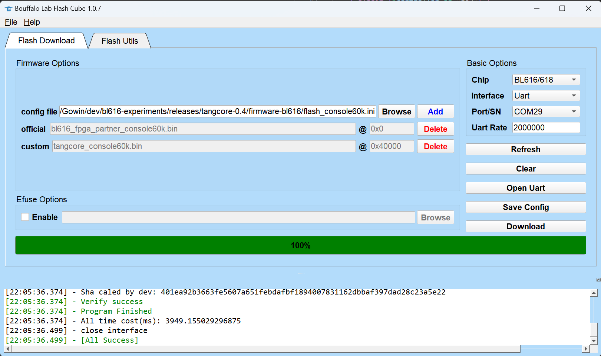
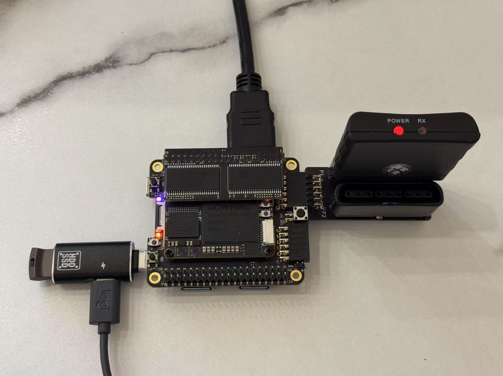
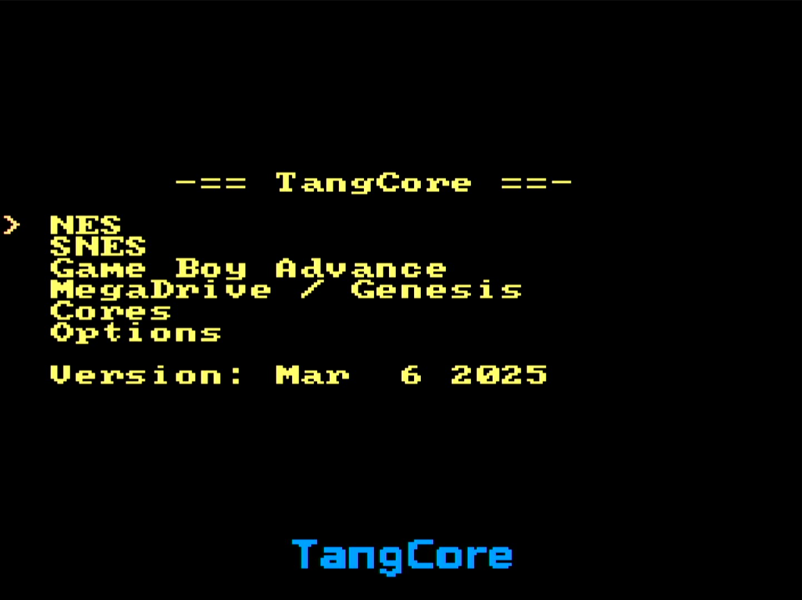

# TangCore Retro Gaming Setup Guide

## 📋 Table of Contents
- [TangCore Retro Gaming Setup Guide](#tangcore-retro-gaming-setup-guide)
  - [📋 Table of Contents](#-table-of-contents)
  - [🎮 Supported Devices](#-supported-devices)
  - [📦 Pre-Install Checklist](#-pre-install-checklist)
  - [🔧 Firmware Installation](#-firmware-installation)
  - [🕹️ Game System Setup](#️-game-system-setup)
    - [USB drive content](#usb-drive-content)
    - [Hardware Assembly](#hardware-assembly)
  - [🚨 Troubleshooting](#-troubleshooting)

---

## 🎮 Supported Devices

| Board Model       | FPGA Capacity | Compatible Cores             | Status        |
|-------------------|---------------|------------------------------|---------------|
| Tang Console 60K  | 60K LUT       | All cores                    | ✔️ Great  |
| Tang Mega 60K     | 60K LUT       | All cores                    | ✔️ Great   |
| Tang Mega 138K    | 138K LUT      | All cores                    | ✔️ Great   |
| Tang Primer 25K   | 25K LUT       | NESTang, SNESTang only       | ⚠️ Limited   |
| Tang Nano 20K     | 20K LUT       | *Unsupported*                | ❌ Not working   |

---

## 📦 Pre-Install Checklist
- [ ] Bouffalo Lab Dev Cube v1.8.4+ ([Download](https://dev.bouffalolab.com/download))
- [ ] USB 2.0 drive (FAT32/exFAT, ≤32GB recommended)
- [ ] USB-C OTG adapter with **power pass-through**
- [ ] Valid GBA BIOS (`gba_bios.bin` MD5: `81977335...`)
- [ ] Latest [TangCore Release Package](https://github.com/nand2mario/tangcore/releases)

---

## 🔧 Firmware Installation

1. Extract release package
2. Launch Dev Cube → **Browse** → Select:
   ```bash
   /firmware-bl616/flash_<board-model>.ini
   ```
   *(e.g., `flash_tang_console_60k.ini`)*

3. Boot Mode Activation:
   - Hold **BOOT** button → Connect USB → Release after connection

4. Flash Process:
   - Refresh COM ports → Select Port/SN → **Download**
   - Confirm success screen:

     
   *Green status indicates successful programming*

---

## 🕹️ Game System Setup

### USB drive content
```bash
📁 USB_ROOT/
├── 📁 cores/        # Core binaries from release
├── 📁 nes/          # .nes files
├── 📁 snes/         # .smc/.sfc files
├── 📁 gba/
│    └── 🗎 gba_bios.bin  # Mandatory BIOS
└── 📁 genesis/      # .bin/.md files
```

### Hardware Assembly
1. Connect components as shown:  
   

   *Left: OTG+USB | Right: DS2 PMOD+Wireless Receiver | Top: HDMI output*

2. Power sequence:
   - Insert USB drive → Connect OTG → Apply power

3. Initial Boot:
   - FPGA auto-programs (5-7 sec)
   - Main menu appears 

   

   *Navigation using gamepad*

---

## 🚨 Troubleshooting

| Symptom                | Quick Fix                                  | Or you can try                |
|------------------------|--------------------------------------------|-------------------------------|
| No video output        | Check HDMI connection → Verify TV input    | Test with alternate display   |
| USB not recognized     | Reformat drive in FAT32 or exFAT           | Try different OTG adapter     |
| GBA core failure       | Verify BIOS presence → Check MD5 hash      | Test with known-good ROM      |
| Random freezes         | Use 2A power supply → Remove peripherals   | Check SDRAM module            |
| Controller unresponsive| Check DS2 PMOD connection                  | Test with wired gamepad       |

---

[Report Issue](https://github.com/nand2mario/tangcore/issues)

---

[TangCore](https://github.com/nand2mario/tangcore) is an independent open-source project. Play thoughtfully. Code joyfully. 🕹️✨

