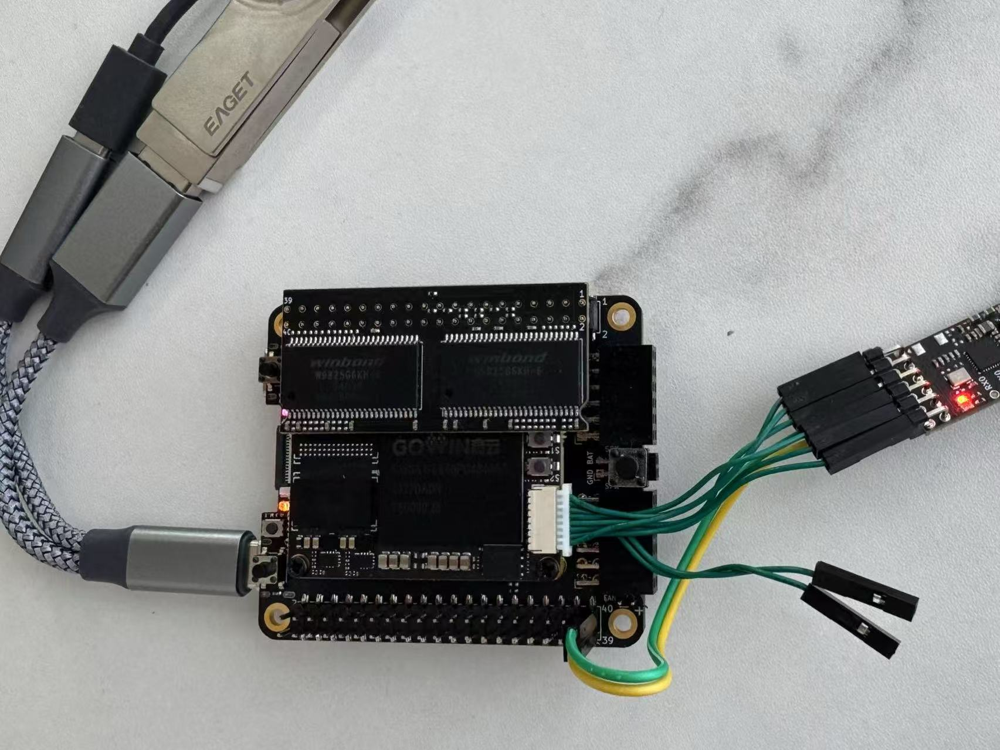

# TangCore Architecture Overview

TangCore uses a different approach to development than previous versions of nestang/snestang. Here's a comparison of the two:

Old NESTang/SNESTang architecture:

TangCore architecture:

Here are the differences:

* The firmware runs on FPGA in old NESTang/SNESTang, while it now runs on the BL616 MCU. This saves a fair amount of FPGA resources, which should be used for the gaming cores.
* For core switching, the old NESTang/SNESTang needs to write to the NOR flash chip, which is slow. Now firmware-bl616 uses JTAG protocol to directly write to the FPGA SRAM, which is much faster.
* Before, the cores and roms are stored on the SD card. Now the cores and roms are stored on a USB stick connected to the BL616. Using the USB interface allows us to support more types of USB devices in the future.
* For debugging, we used to rely on UART-over-USB through the BL616. Now we use the debug connector on the FPGA SOM.

Here's a picture of the TangCore development setup:

The end user does not need the SOM connector for debugging. Otherwise the seutp is the same as the developement setup.

Debug connection:

* We use the Sipeed RV-debugger dongle to connect the FPGA to PC.
* The FPGA SOM debug port has the following pinout (from top to bottom): GND, BL616_RX, BL616_TX, TDI, TCK, TDO, TMS, 5V0. We connect the TDI, TCK, TDO, TMS pins to the RV-debugger. BL616_TX carries commands from BL616 to FPGA, including rom data, overlay display updates and etc. BL616_RX carries responses from FPGA back to BL616, including joypad updates. The protocol is described below. The current baud rate is 2000000 bps. I have a python script decoding these messages for debugging.

