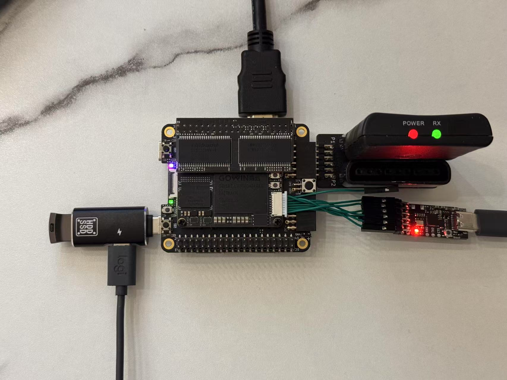

# Debugging your core

## GAO debugging

Gowin FPGA debugging is mostly done through Gowin Analyzer Oscilloscope (GAO) over JTAG. JTAG is normally provided by the Sipeed BL616 firmware through USB. Now that TangCore has taken over the BL616, we need another way to provide JTAG functionality. We can do that with SOM connector on the FPGA module:



Here we use the 8-pin debug wire (provided by Sipeed with their boards), and Sipeed RV Debugger to connect JTAG and UART (BL616_UART_TX to the RV debugger's RX pin).

This way we can use Gowin Analyzer Oscilloscope to debug our gateware as normal. You can also put the debugging bitstream (`ao_0.bin`) on the USB drive and use TangCore menu to program it if you need to.

## Monitor MCU-FPGA communcation

The BL616 MCU acts as the master in UART communication. Communication happens in commands and responses. If you need to observe the communication to help debugging your core, you can do that with the script `python tangcore\firmware-bl616\scripts\liveuart.py <com_port>`. It will try to decode and dump the communication. For instance, core loading looks like this,

```
fatfs: found /dev/sda
mount_volume: disk_initialize success
mount_volume: find_volume()=0

Writing 2303277 bytes...
ID=0001481b, status=70006020
Erase: pollFlag...
Erase: OK
Erase: disableCfg...
Erase: disableCfg done...
Erase: status=0x30000020

Erasing again...
ID=0001481b, status=30000020
Erase: pollFlag...
Erase: OK
Erase: disableCfg...
Erase: disableCfg done...
Erase: status=0x30000020

Load SRAM

Usercode=0x0000, status=0x70006020

Time: total=2169121 us, jtag=0 us, flash=0 us, writetdi=75 us<get_core_id>
<overlay_state:b'\x01'>

       -== TangCore ==-
NES
SNES
Game Boy Advance
MegaDrive / Genesis
Cores
Options
Version: Mar  7 2025<get_core_id>
<overlay_state:b'\x01'>
```

So it is helpful in checking what is happening. 

You can also watch the traffic the other way (FPGA to MCU) over the other pin (BL616_UART_RX) with `python liveuart.py -f <com_port>`. It contains mostly joypad status updates and responses to other commands from the MCU.

## UART Protocol

The protocol is handled in `iosys_bl616.v`. If you need to debug BL616-FPGA communication, then here's the protocol in use:

| Command | Description |
|-----|-----|
| 0x01|get core ID (response: 0x11, followed by one byte of core ID). this is used to identify the core and check whether the core is ready|
|0x02|get core config string (response: 0x22, followed by null-terminated string)|
|0x03 x[31:0]|set core config status|
|0x04 x[7:0] y[7:0]|move overlay text cursor to (x, y)|
|0x05 <string>|display null-terminated string from cursor|
|0x06 loading_state[7:0]|set loading state (rom_loading)|
|0x07 len[23:0] <data>|load len (MSB-first) bytes of data to rom_do|
|0x08 x[7:0]|turn overlay on/off|

Messages from FPGA to BL616:

| Response | Description |
|-----|-----|
| 0x01 joy1[7:0] joy1[15:8] joy2[7:0] joy2[15:8]|     Every 20ms, send joypad state|
|0x11 core_id[7:0]|send core ID|
|0x22 <string>|send null-terminated core config string|


