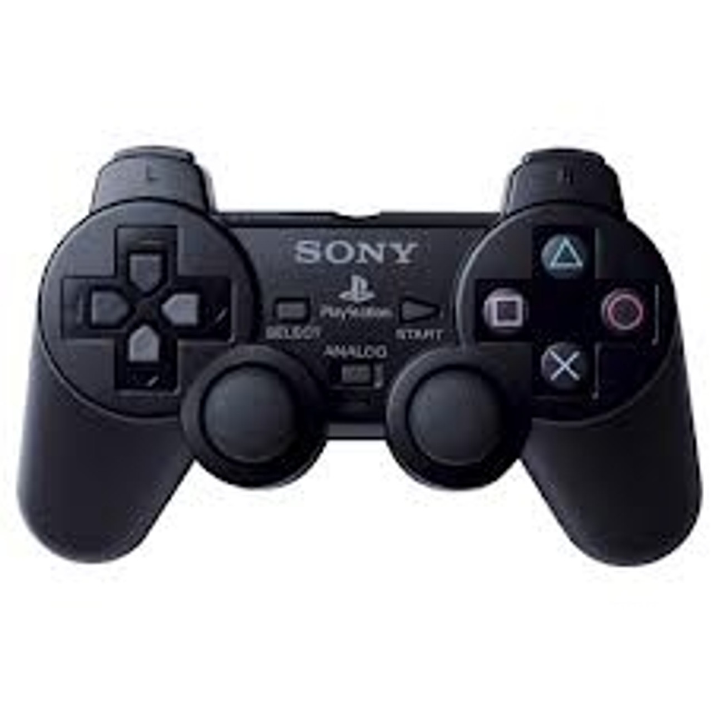
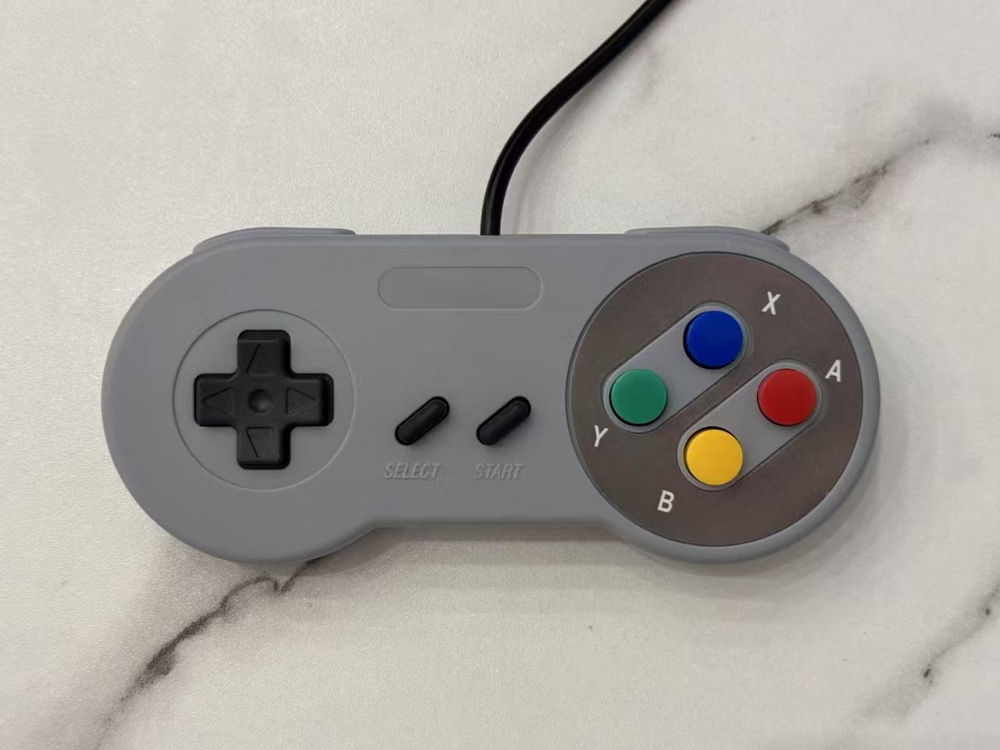
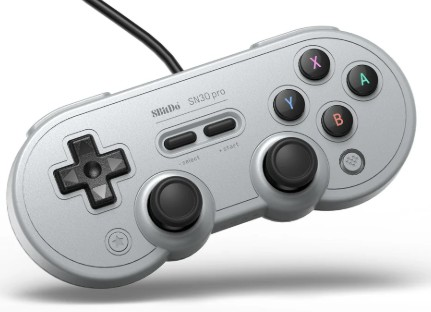
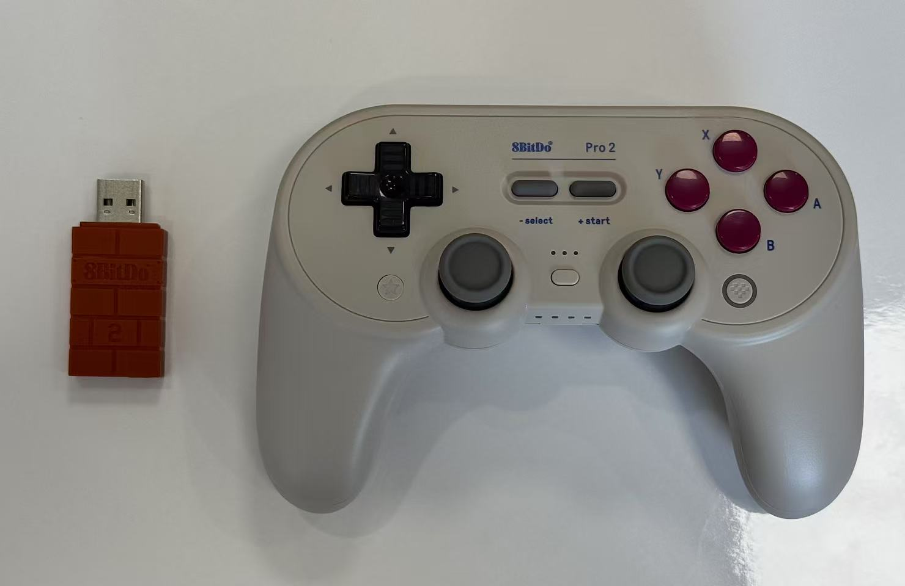

# Game Controllers

TangCore supports several types of game controllers including Dualshock 2 (DS2), USB HID, and USB Xinput devices. Controller compatibility will continue to improve with future updates. Note: To use USB controllers, you'll need a USB hub with at least 3 ports - one for the USB drive and two for controllers.

| Controller | Status | Photo |
|-----|-----|-----|
| DualShock 2 or compatible | ✅ Fully working (requires DS2 PMOD adapter) |  |
| Sipeed SNES-style USB Controller | ✅ Fully working |  |
| 8BitDo SN30 Pro Wired Controller | ✅ Fully working |  |
| 8BitDo Wireless USB Adapter | ✅ Fully working (XInput mode only) |  |
| Xbox One/Series, PS3/PS4/PS5, Nintendo Switch Pro | ⚠️ Not supported yet |  |

My personal favorite is the 8BitDo wireless adapter paired with an 8BitDo Pro 2 controller. It offers excellent button layout, reliable wireless connectivity, and minimal input lag. Please note that each adapter can only pair with one controller, so you'll need two adapters for two-player gaming.

